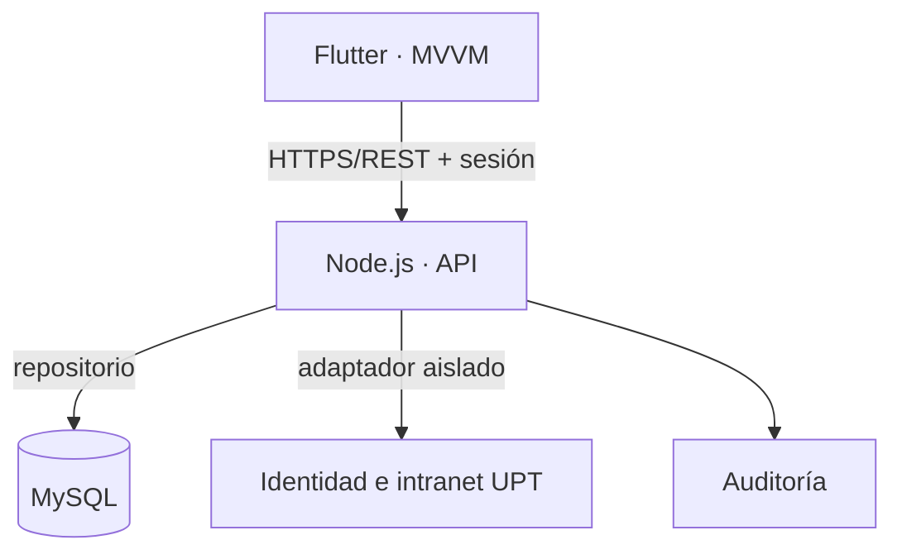
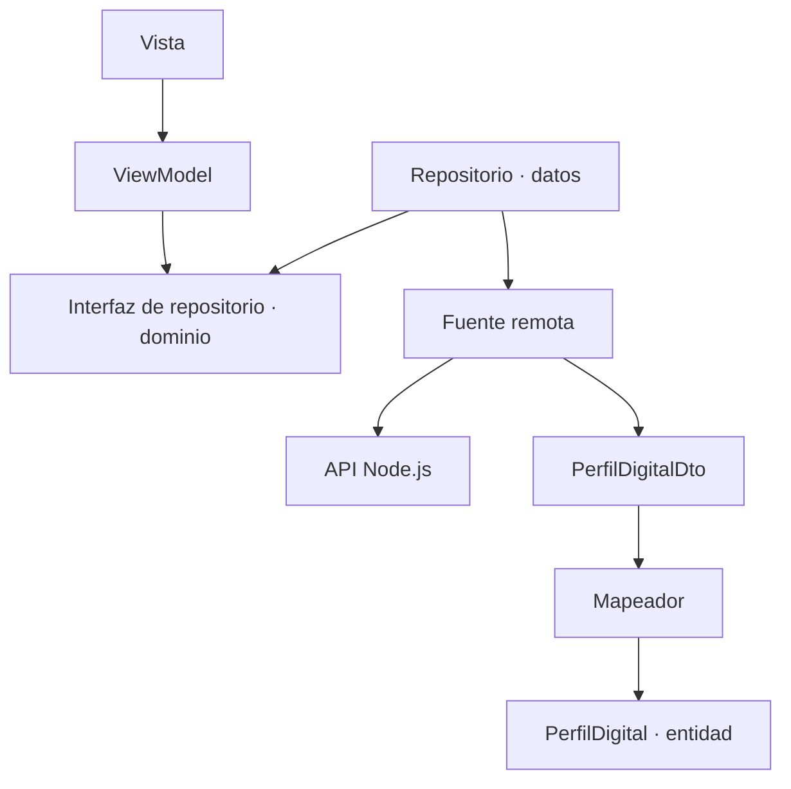
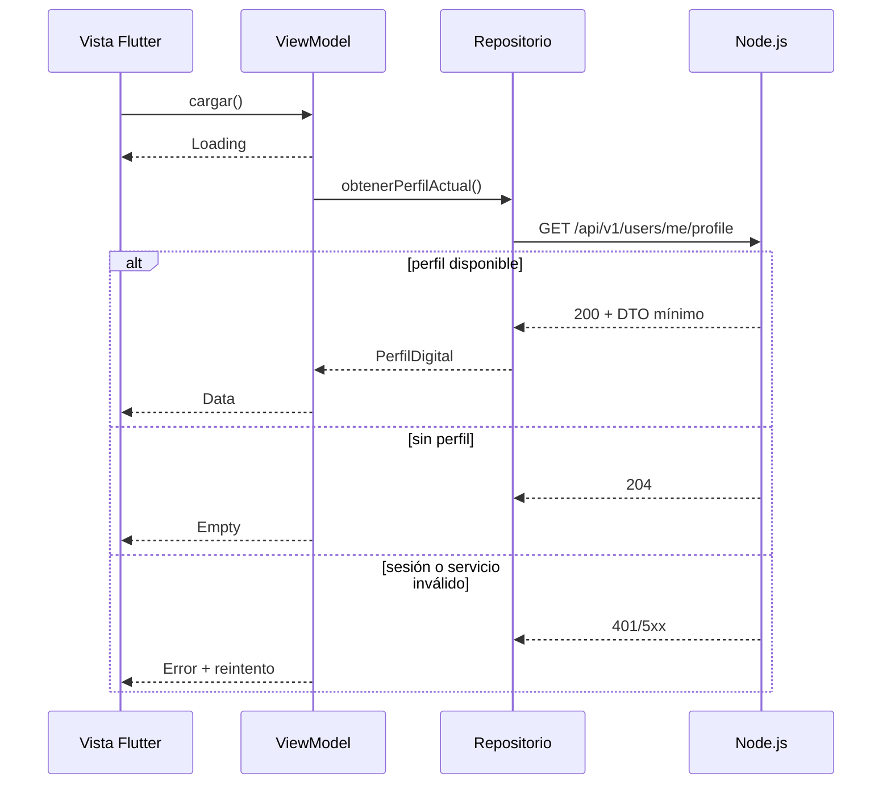

# Arquitectura del incremento · Perfil de identidad digital

## Contexto del sistema

Flutter no conoce credenciales de MySQL ni la automatización de intranet. Las decisiones de seguridad se ejecutan en Node.js.

## Dependencias de la funcionalidad vertical

La capa de dominio no importa datos ni presentación. El DTO y la entidad son tipos distintos. El ensamblaje se realiza en `core/di/app_dependencies.dart`.

## Secuencia de consulta

